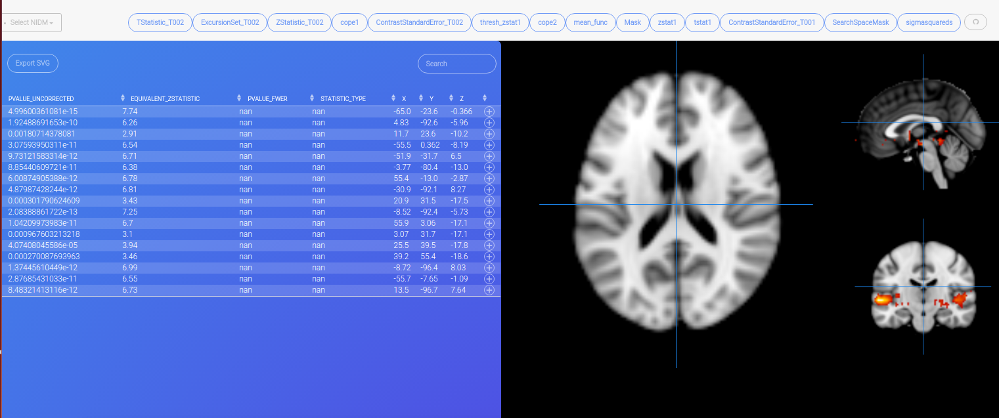

# nidm-viewer

NIDM Results Viewer

 - parses peak coordinates and associated brain maps
 - interactive coordinate browsing
 - save image to file (export)
 - produces html code for embedding, or local viewer
 - uses [font brain](http://vsoch.github.io/font-brain) for nidm and brain imaging icons

###### Documentation
Complete documentation [is available](http://nidmviewer.readthedocs.org/en/latest/)

###### Installation

To install

      pip install nidmviewer

To install development version:

      pip install git+git://github.com/vsoch/nidmviewer.git

#### Running Examples

###### Python (server)

see [an example](examples/generate_viewer.py)

##### Command Line

###### Usage

When installing with setup.py, an executable, `nidmviewer` is installed in your bin to view nidm files on the fly:

       nidmviewer fsl/nidm.ttl

You can see the basic usage by typing the command:

         nidmviewer 
          
         usage: nidmviewer [-h] [--columns_to_remove COLUMNS_TO_REMOVE] ttl base
         nidmviewer: error: too few arguments
         usage: nidmviewer [-h] [--columns_to_remove COLUMNS_TO_REMOVE] ttl base

         command line or server tool to view or compare nidm results.

         positional arguments:
           
             ttl                   List of comma separated ttl files to parse.
             base                  base image (standard brain map) to use for the viewer
                                   background.

         optional arguments:
             
            -h, --help            show this help message and exit
            --columns_to_remove COLUMNS_TO_REMOVE
           
                                  Comma separated list of columns to remove from viewer.

Please submit bugs, comments, and feedback as PRs. This application has not been rigorously tested. Thanks!

###### Many Thanks
[Papaya Viewer](https://github.com/rii-mango/Papaya), we salute you!

#### Coming Soon

 - plotting
 - please [submit feedback and requests](https://github.com/vsoch/nidmviewer)

[demo](http://vsoch.github.io/nidmviewer)
